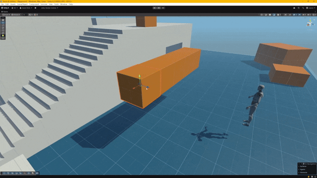

# Object Snapper

A Unity Editor tool that provides a radial snap menu for quickly snapping selected objects to surfaces in 6 directions.

## The Problem

In Unity, precise object placement is tedious and imprecise:
- **Snapping walls to walls** requires manual dragging with imprecise gizmo control
- **Aligning props to surfaces** involves trial-and-error positioning
- **Placing multiple objects** perfectly takes significant time with no guarantee of accuracy
- Unity's default movement tools lack the precision and speed needed for level design workflows

## The Solution

**Object Snapper** eliminates this friction. Simply select your objects, press `Shift+G`, and snap them to surfaces in any of 6 directions with pixel-perfect precision. Real-time preview shows exactly where objects will land before you confirm. What used to take manual adjustments now happens in milliseconds.

## Demo

## Features

- **Radial Snap Menu** - Intuitive radial interface activated with `Shift+G`
- **6-Direction Snapping** - Snap objects Forward, Backward, Up, Down, Left, or Right
- **Real-time Preview** - See wireframe gizmos showing where objects will snap before confirming
- **Multiple Alignment Modes**:
  - **Surface** - Align object surface to hit point (default)
  - **Center** - Align to target object's center
  - **Pivot** - Align to target object's pivot point
- **Layer Mask Filtering** - Control which layers can be snapped to
- **Keyboard Shortcuts** - Use Shift+WASD/QE keys for rapid snapping
- **Local/World Space** - Snap in world space or object's local space
- **Multi-Object Support** - Snap multiple selected objects at once
- **Full Undo Support** - All snap operations can be undone with Ctrl+Z
- **Configurable Offset** - Add spacing between snapped objects

## Installation

### Option 1: Unity Package Manager (Git URL)

1. Open Unity Package Manager (`Window > Package Manager`)
2. Click the `+` button and select "Add package from git URL..."
3. Enter: `https://github.com/AFreoN/object-snapper.git`

### Option 2: Manual Installation

1. Download or clone this repository
2. Copy the `object-snapper` folder into your Unity project's `Assets` folder

## Usage

### Basic Usage

1. Select one or more objects in the Scene View
2. Press `Shift+G` to open the radial snap menu
3. Hover over a direction button to see a preview
4. Click the button or use keyboard shortcuts to snap
5. Press `Shift+G` again or right-click to close the menu

### Keyboard Shortcuts

While the radial menu is active (hold Shift):

| Key | Direction |
|-----|-----------|
| Shift+W / Shift+Arrow Up | Forward |
| Shift+S / Shift+Arrow Down | Backward |
| Shift+D / Shift+Arrow Right | Right |
| Shift+A / Shift+Arrow Left | Left |
| Shift+E | Up |
| Shift+Q | Down |

### Settings

Access settings via `Tools > Object Snapper Settings`

#### Performance
- **Snap Delay** - Delay between snapping multiple objects (0 for instant)
- **Max Raycast Distance** - Maximum distance to search for snap targets

#### Snapping Behavior
- **Alignment Mode** - Surface, Center, or Pivot alignment
- **Offset Distance** - Additional spacing between snapped objects
- **Use Local Space** - Snap relative to object's rotation

#### Visual Settings
- **Show Preview** - Display wireframe preview gizmos
- **Show Warnings** - Log warnings when snapping fails

#### Advanced
- **Snap Layers** - Layer mask to filter snap targets

### Quick Presets

The settings window includes preset buttons for common configurations:
- **Fast Snapping** - Zero delay, keyboard shortcuts enabled
- **Precise Control** - Slower snapping with preview
- **With Spacing** - Adds 0.1 unit offset between objects
- **Center Align** - Centers objects on targets
- **Pivot Align** - Aligns to target pivots

## Requirements

- Unity 2020.3 or later
- Objects must have Colliders for raycasting to work

## License

MIT License - See [LICENSE](LICENSE) for details.
